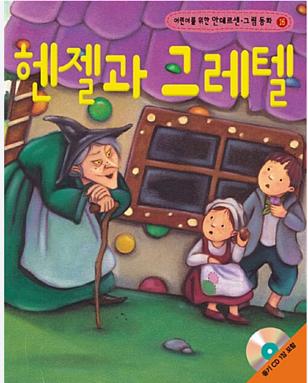
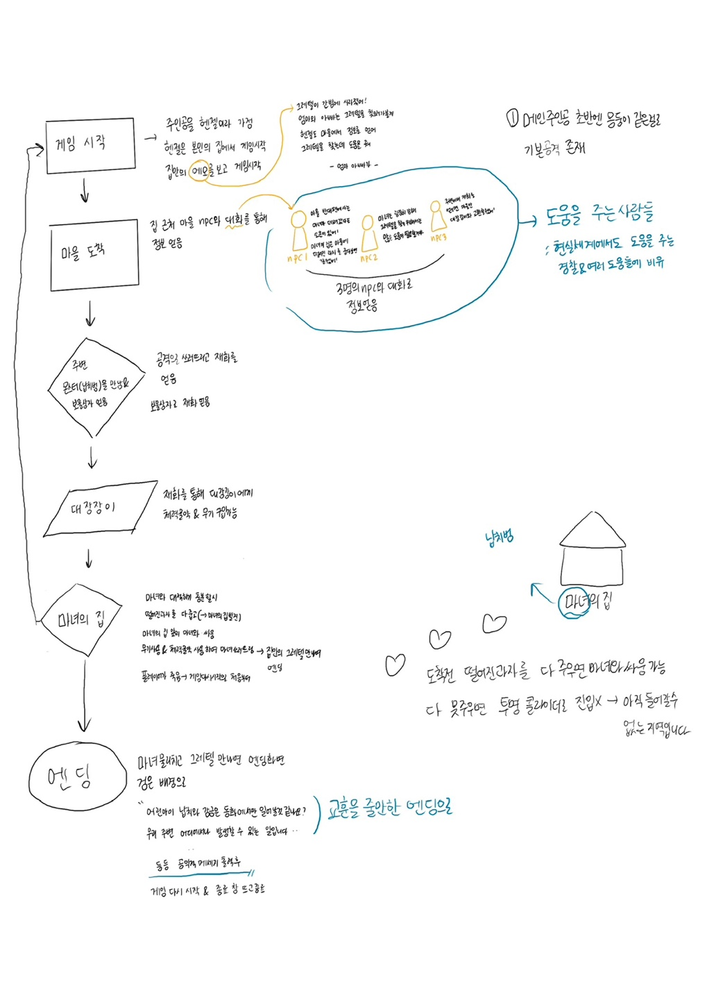
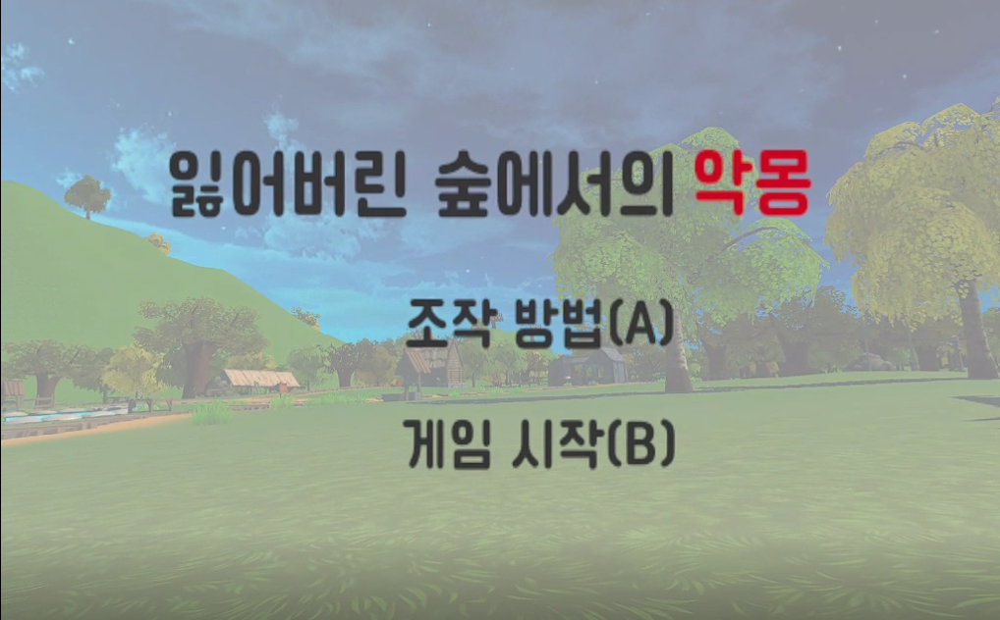
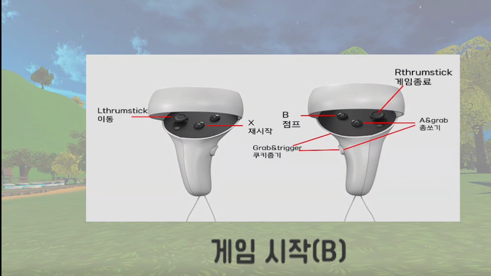
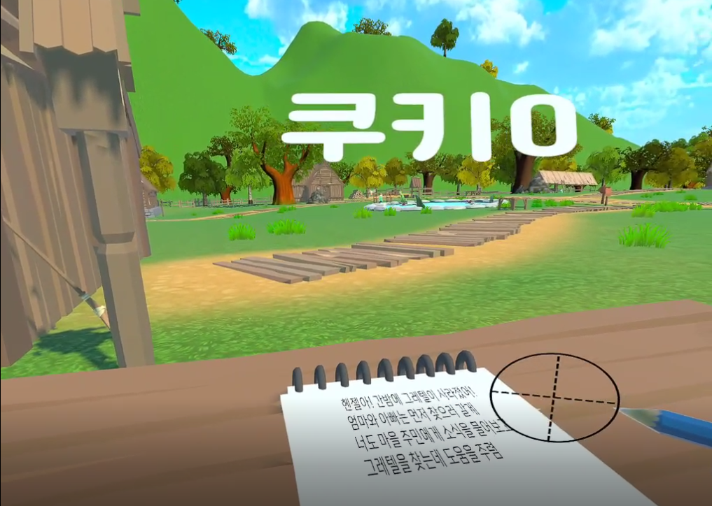

# 🌲 Nightmare in the Lost Forest

> VR 기반의 몰입형 동화 스토리 어드벤처 게임  
> **Unity + Oculus Quest 2** 환경에서 개발된 VR 게임입니다.

---

## 📖 프로젝트 소개

동화 **헨젤과 그레텔**에서 착안한 VR 게임입니다.  
단순한 숲 탈출이 아닌, **교훈과 메시지**를 담은 분기형 스토리로 구성되어 있습니다.

Unity와 Oculus Quest 2를 활용해 **몰입형 VR 경험**을 제공하며,  
어둠 속에서 길을 찾고, NPC와 상호작용하며 스토리를 진행하게 됩니다.

---

## 🎮 게임 진행 방식

- VR 컨트롤러를 통해 직접 상호작용
- 어두운 숲을 탐험하며 단서와 오브젝트를 발견
- 선택에 따라 스토리가 달라지는 **멀티 엔딩 구조**
- 시각/청각적 몰입을 강화한 연출

---

## 📌 주요 기능

| 기능 | 설명 |
|------|------|
| 🎮 VR 조작 | XR Interaction Toolkit을 통해 오큘러스 컨트롤러로 조작 |
| 🧩 퍼즐 요소 | 특정 조건 하에서만 진행 가능한 퍼즐 구성 |
| 🎭 스토리 분기 | 선택지에 따라 결말이 달라지는 분기형 엔딩 |
| 🔊 사운드 연출 | 환상적인 배경음과 사운드 이펙트 |
| 🎨 외부 에셋 활용 | Stylized NPC, AllSkyFree, JMO 애니메이션 팩 등 사용 |

---

## 🛠 개발 환경

| 항목 | 내용 |
|------|------|
| Engine | Unity 2022.x |
| Device | Oculus Quest 2 |
| Language | C# |
| Toolkit | Unity XR Interaction Toolkit |
| Team | 4명 협업 프로젝트 |

---

## 🖼 추가 이미지

### 📍 게임 시나리오 & 환경

  

---

## ⚠️ 구현 중 어려웠던 점

- Unity를 데스크탑이 아닌 Oculus에 직접 연동하려다 보니 예기치 않은 문제들이 많았음
- VR 컨트롤, 상호작용, UI 등 모든 것을 새롭게 이해하고 적용해야 했음
- 하지만 소수 인원이 **협업과 의견 교환**을 통해 큰 성취감을 느꼈음

---

## 🚀 향후 개선 방향

- 더 정교한 UI 인터랙션 구성
- 새로운 맵 및 분기 시나리오 추가
- 성능 최적화 및 XR 플랫폼 확장

---

## 👨‍👩‍👧‍👦 팀원

- 20200690 양성은  
- 20180594 손영훈  
- 20200131 김도윤  
- 20210131 김나영

---

## 📦 사용 에셋

- Stylized NPC - Peasant Nolant  
- JMO Character Animation Pack  
- Free Fantasy Adventure Music Pack  
- AllSkyFree Skybox  

---
## 🎬 발표 영상 보기

[▶ 발표 영상 보기 (Google Drive)](https://drive.google.com/file/d/1OD_2Vck9AHS0SDuGtN4FqxWqHlKF1vsn/view?usp=sharing)

---

## 🙏 감사합니다!

> *본 프로젝트는 게임 기획, 개발, 연출, 협업까지 전 과정을 직접 수행한 팀 기반 작품입니다.*  
> *VR의 기술적 도전을 극복하며 완성한 창작물을 소개하게 되어 영광입니다.*
